<p align="center">
  
</p>

<h1 align="center">TelecomHand</h1>

<p align="center">
  <strong>Contrôlez votre PC Windows ou votre machine Linux / Raspberry Pi depuis Android.</strong><br>
  Souris, clavier, aperçu d'écran, volume et raccourcis système — à travers votre réseau privé Tailscale.
</p>

<p align="center">
  
  
  
  
  <a href="https://github.com/0x80070006/TelecomHand/releases/tag/TelecomHandv1.3"></a>
</p>

> [!WARNING]
> ### 🚧 Application encore en développement
>
> **TelecomHand est actuellement en cours de développement actif.**
>
> Certaines fonctionnalités peuvent encore présenter des **bugs**, de légères **latences** ou des comportements inattendus selon l'appareil, la version d'Android ou l'application utilisée.
>
> Le projet évolue régulièrement afin d'améliorer la **fluidité**, la **précision de frappe**, la **stabilité**, les **suggestions** et la **correction de texte**.
>
> Merci de garder à l'esprit qu'il ne s'agit pas encore d'une version totalement stable.

---

## 📦 Téléchargements

<p align="center">

[](https://github.com/0x80070006/TelecomHand/releases/download/v1.5/TelecomHand-Android-v1.5.apk)

[](https://github.com/0x80070006/TelecomHand/releases/download/v1.5/TelecomHand-Windows-x64-v1.5.zip)

[](https://github.com/0x80070006/TelecomHand/releases/download/v1.5/TelecomHand-RaspberryPi.tar.gz)

[](https://github.com/0x80070006/TelecomHand/releases/tag/v1.5)

</p>

---

## ✨ En bref

TelecomHand transforme votre téléphone Android en télécommande pour vos ordinateurs et Raspberry Pi. L'application permet d'enregistrer plusieurs appareils, de passer rapidement de l'un à l'autre et d'afficher des commandes adaptées au système distant.

| Fonction | Windows | Linux / Raspberry Pi |
| --- | :---: | :---: |
| Pavé tactile / déplacement souris | ✅ | ✅ |
| Clic gauche / clic droit | ✅ | ✅ |
| Clavier et saisie directe | ✅ | ✅ |
| Backspace distant | ✅ | ✅ |
| Aperçu de l'écran distant | ✅ | ✅ |
| Volume + / Volume - / Muet | ✅ | ✅ |
| Raccourcis système dédiés | ✅ | — |
| Sélection de la sortie audio | — | ✅ |
| Connexion via Tailscale | ✅ | ✅ |

---

## 📱 Aperçu de l'application

<p align="center">
  
  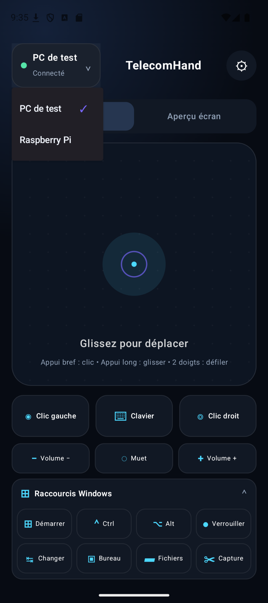
  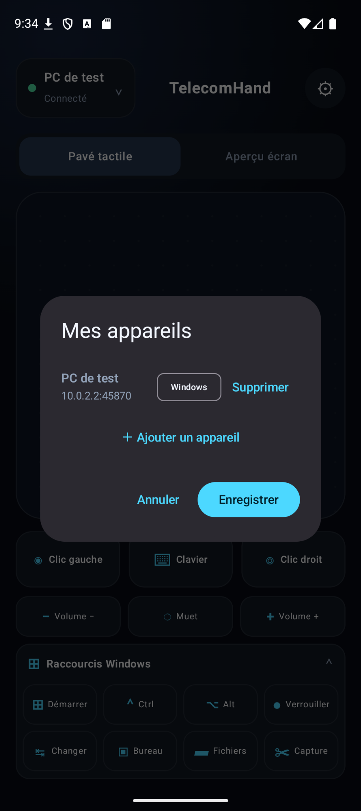
</p>

<p align="center">
  <sub>Interface principale · changement d'appareil · gestion des machines enregistrées</sub>
</p>

### Pavé tactile et saisie

<p align="center">
  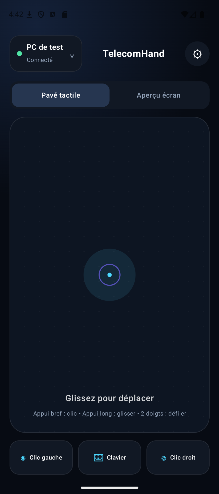
  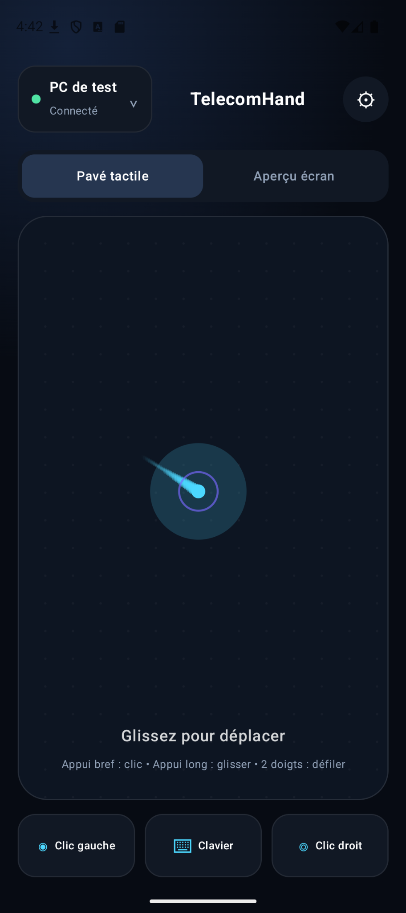
  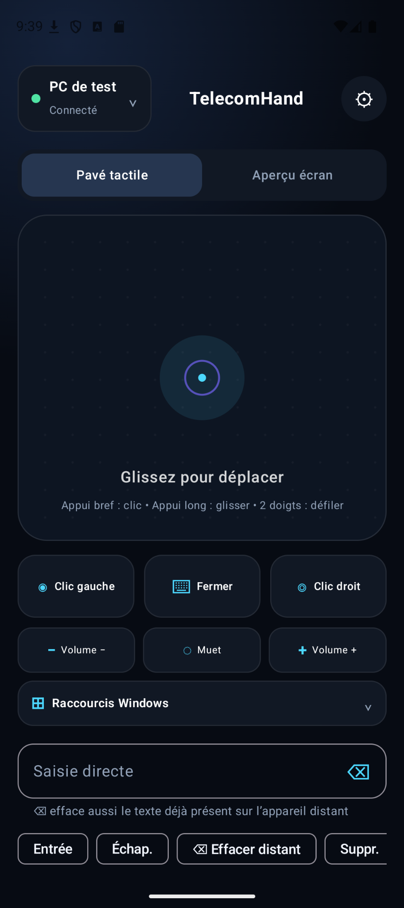
</p>

Le pavé tactile permet de déplacer le pointeur, cliquer, glisser et défiler. Le clavier intègre une saisie directe et un vrai **Backspace distant**, y compris lorsqu'aucun texte n'est présent dans le champ du téléphone.

### Aperçu de l'écran distant

<p align="center">
  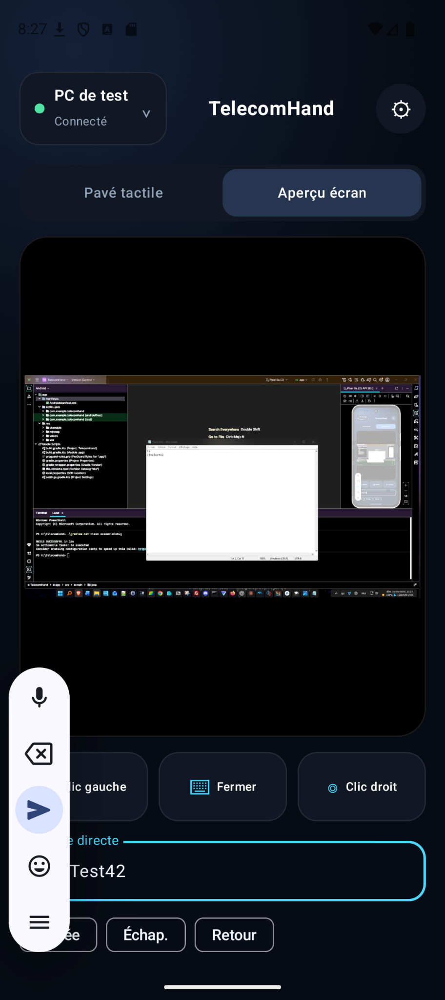
</p>

L'onglet **Aperçu écran** permet de visualiser la machine distante depuis l'application Android.

### Windows

<p align="center">
  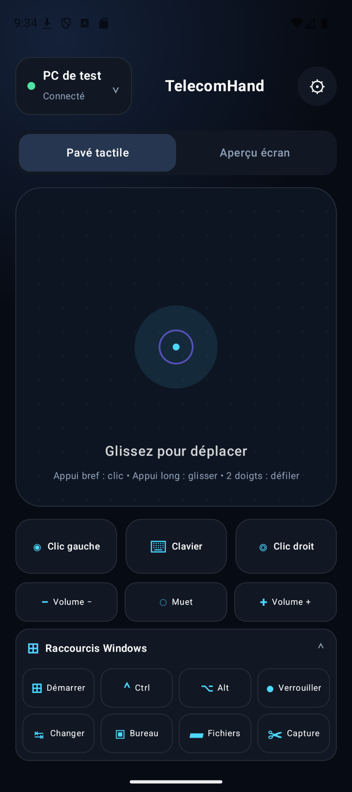
  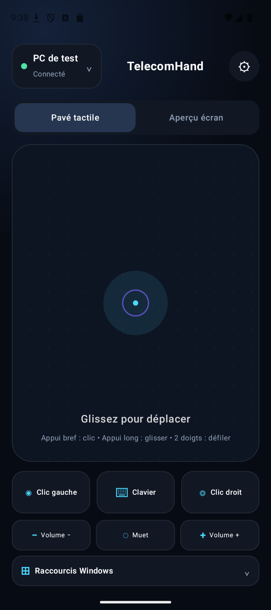
</p>

Pour un appareil configuré en **Windows**, TelecomHand affiche un panneau de raccourcis dédié : menu Démarrer, `Ctrl`, `Alt`, verrouillage de session, Bureau, Fichiers, capture et commandes de volume.

### Linux / Raspberry Pi

<p align="center">
  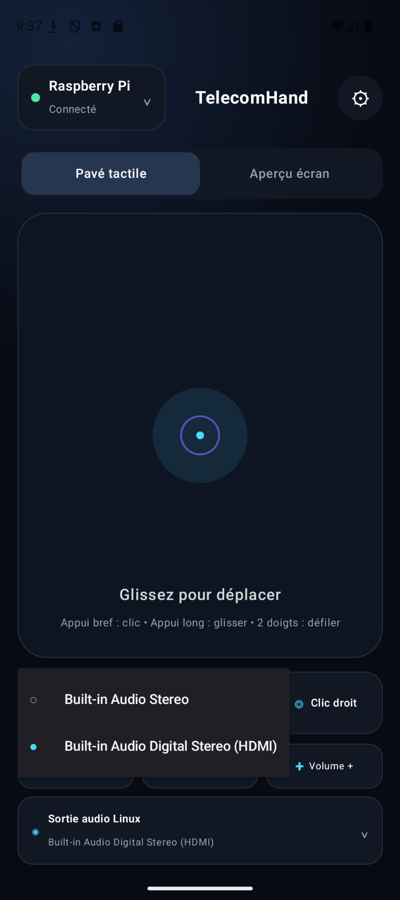
  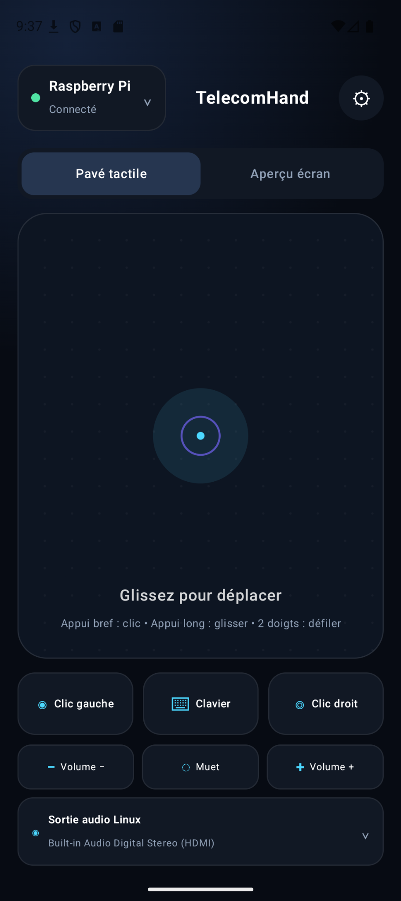
  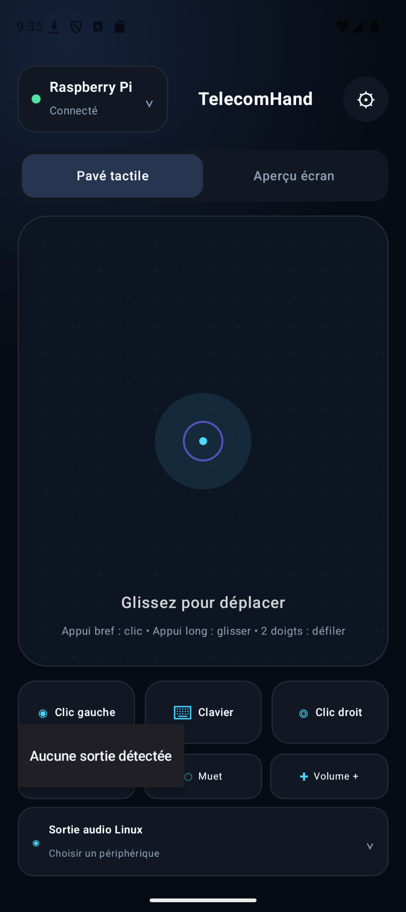
</p>

Sur Linux, TelecomHand peut récupérer les sorties audio disponibles et sélectionner le périphérique utilisé par la machine distante, par exemple **HDMI**, haut-parleurs, casque ou carte son USB.

<details>
<summary><strong>Voir davantage de captures d'écran</strong></summary>
<br>
<p align="center">
  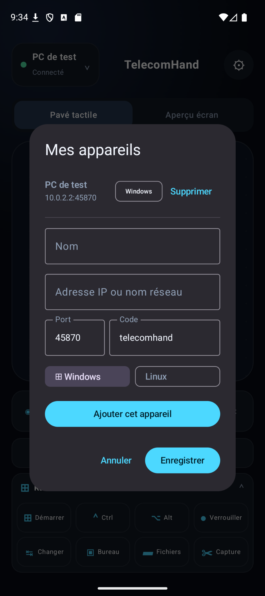
  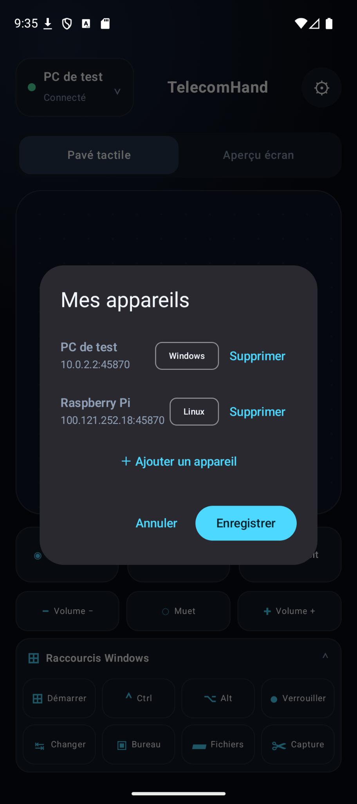
  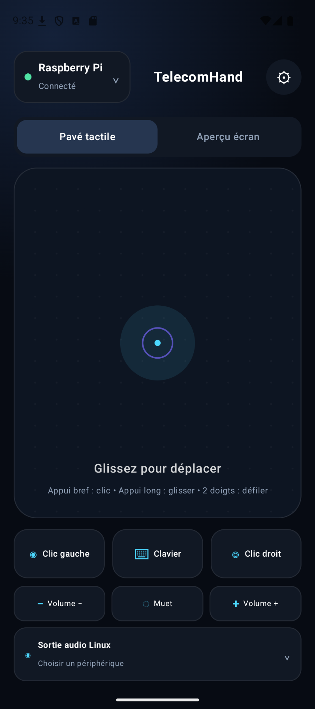
</p>
</details>

---

## 🔐 Connexion avec Tailscale

L'utilisation de **Tailscale** est recommandée. Tailscale crée un réseau privé entre vos appareils et attribue à chaque machine une adresse du type :

```text
100.x.x.x
```

Il n'est donc normalement pas nécessaire d'exposer directement TelecomHand sur Internet.

```text
Téléphone Android
      │
      │  Réseau privé Tailscale
      ▼
┌──────────────────────────────┐
│ PC Windows / Linux / Pi      │
│ Agent TelecomHand            │
│ Ports : 45870 / 45871        │
└──────────────────────────────┘
```

### Exemple de configuration

Dans l'application Android :

```text
Nom : Raspberry Pi
Système : Linux
Adresse IP : <IP_TAILSCALE>
Port : 45870
Code : <VOTRE_CODE>
```

Pour Windows :

```text
Nom : Mon PC
Système : Windows
Adresse IP : <IP_TAILSCALE_WINDOWS>
Port : 45870
Code : <VOTRE_CODE>
```

> [!CAUTION]
> Ne publiez jamais votre véritable **code TelecomHand** dans un dépôt GitHub public.

---

## 🚀 Installation rapide

### 📲 Android

Téléchargez **`TelecomHand-Android-v1.3.apk`**, puis installez l'APK sur votre téléphone. Android peut demander l'autorisation d'installer des applications provenant de sources externes.

Une fois l'application installée :

1. ouvrez TelecomHand ;
2. ajoutez un appareil ;
3. choisissez **Windows** ou **Linux** ;
4. renseignez son adresse IP Tailscale ;
5. renseignez le port et votre code TelecomHand ;
6. enregistrez puis connectez-vous.

### 🪟 Windows

Téléchargez **`TelecomHand-Windows-x64.zip`** depuis la [release v1.3](https://github.com/0x80070006/TelecomHand/releases/tag/TelecomHandv1.3), décompressez l'archive puis utilisez l'installateur fourni.

Le paquet contient notamment les scripts nécessaires à l'installation de TelecomHand comme **service Windows**. Une fois installé :

- le service démarre automatiquement avec Windows ;
- l'agent peut être relancé automatiquement en cas d'arrêt ou de plantage ;
- aucune console n'a besoin de rester ouverte ;
- TelecomHand peut fonctionner en arrière-plan ;
- Tailscale peut également fonctionner automatiquement au démarrage.

Le service apparaît sous le nom :

```text
TelecomHand Remote Control
```

### 🥧 Raspberry Pi / Linux

Téléchargez **`TelecomHand-RaspberryPi.tar.gz`**, puis extrayez l'archive :

```bash
tar -xzf TelecomHand-RaspberryPi.tar.gz
cd TelecomHand-RaspberryPi
```

Lancez ensuite l'installation :

```bash
chmod +x install.sh
sudo ./install.sh
```

---

## 🛠️ Commandes utiles sur Raspberry Pi

Vérifier l'état du service :

```bash
sudo systemctl status telecomhand
```

Consulter les derniers logs :

```bash
sudo journalctl -u telecomhand -n 15 --no-pager
```

Redémarrer TelecomHand :

```bash
sudo systemctl restart telecomhand
```

Vérifier Tailscale et récupérer l'adresse IP :

```bash
tailscale status
tailscale ip -4
```

---

## 🖱️ Contrôle à distance

TelecomHand permet notamment :

- le déplacement de la souris ;
- les clics gauche et droit ;
- le glisser-déposer ;
- le défilement à deux doigts ;
- la saisie clavier ;
- l'envoi d'un vrai `Backspace` à la machine distante ;
- l'aperçu de l'écran distant ;
- le contrôle du volume ;
- des raccourcis système adaptés à la machine ;
- la connexion via l'adresse IP Tailscale de la machine.

### Raccourcis Windows

| Commande | Fonction |
| --- | --- |
| `Windows` | Ouvrir le menu Démarrer |
| `Ctrl` | Touche Ctrl |
| `Alt` | Touche Alt |
| `Win + L` | Verrouiller la session |
| `Bureau` | Accéder au bureau |
| `Fichiers` | Ouvrir l'explorateur de fichiers |
| `Capture` | Déclencher une capture |
| `Volume + / -` | Régler le volume |

Le panneau Windows est uniquement affiché pour les appareils déclarés comme étant sous Windows.

### Sortie audio Linux

Pour les appareils Linux / Raspberry Pi, TelecomHand peut afficher les sorties audio disponibles afin de basculer entre différents périphériques :

- HDMI ;
- haut-parleurs ;
- casque ;
- carte son USB ;
- autres périphériques audio détectés par le système.

---

## 🔌 Ports

TelecomHand utilise notamment :

```text
45870
45871
```

L'utilisation de Tailscale permet de faire transiter les connexions à travers le réseau privé Tailscale.

---

## ✅ Configuration validée

### Raspberry Pi

- Tailscale actif ;
- client TelecomHand actif ;
- connexion via IP Tailscale ;
- authentification ;
- contrôle de la souris ;
- aperçu distant jusqu'à `1280×720` ;
- commandes audio.

### Windows

- TelecomHand installé comme service Windows ;
- démarrage automatique ;
- relance automatique de l'agent ;
- Tailscale configuré pour fonctionner automatiquement ;
- contrôle distant via Tailscale ;
- raccourcis clavier Windows ;
- contrôle du volume.

---

## 📁 Fichiers de la release v1.3

```text
TelecomHand-Android-v1.3.apk
TelecomHand-Windows-x64.zip
TelecomHand-RaspberryPi.tar.gz
```

➡️ **[Ouvrir la release TelecomHand v1.3](https://github.com/0x80070006/TelecomHand/releases/tag/TelecomHandv1.3)**

---

## 🔒 Sécurité

TelecomHand donne accès au clavier, à la souris et à certaines fonctions système de la machine distante. Quelques recommandations :

- utilisez un code TelecomHand suffisamment robuste ;
- ne publiez jamais votre code dans le dépôt ;
- utilisez de préférence Tailscale ;
- n'exposez pas directement les ports TelecomHand sur Internet sans protection appropriée ;
- limitez l'accès à votre réseau Tailscale aux appareils autorisés ;
- gardez Windows, Linux, TelecomHand et Tailscale à jour.

---

## 🚀 TelecomHand v1.3

La version **v1.3** ajoute notamment :

- prise en charge du type d'appareil Windows / Linux ;
- panneau de commandes spécifique à Windows ;
- touche Windows ;
- raccourcis `Ctrl` et `Alt` ;
- verrouillage Windows avec `Win + L` ;
- contrôle du volume ;
- sélection de la sortie audio sous Linux ;
- vrai Backspace distant ;
- nouvelles tailles d'icône Android ;
- amélioration du service Windows ;
- meilleure intégration avec Tailscale.

---

<p align="center">
  <br>
  <strong>TelecomHand — Remote control through your private network.</strong>
</p>
