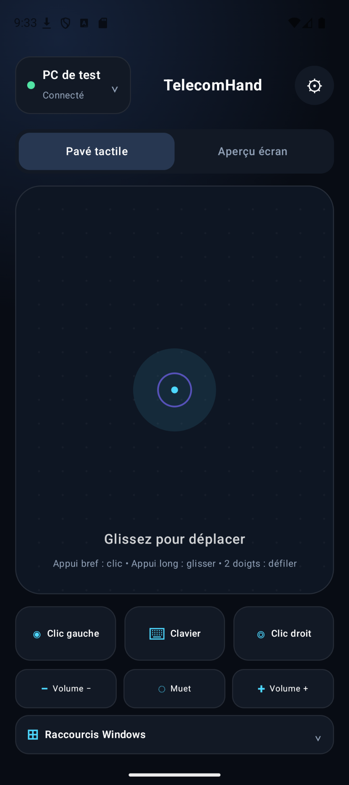

# TelecomHand

Télécommande Android pour contrôler un ordinateur Windows ou une machine Linux / Raspberry Pi sur un réseau privé.

**État :** APK Android v1.8.0 publié ; archives Windows et Raspberry Pi disponibles en v1.7.0. Le dépôt inclut désormais le projet Android, le code des agents et leurs scripts d'installation. La compilation Android de cette source locale avait été validée avant publication ; la reconstruction de tous les paquets de release et l'installation sur un appareil neuf n'ont pas été vérifiées dans cet audit.

## Télécharger

| Plateforme | Version publiée | Fichier |
| --- | --- | --- |
| Android | v1.8.0 | [TelecomHand-Android-v1.8.0.apk](https://github.com/0x80070006/TelecomHand/releases/download/v1.8.0/TelecomHand-Android-v1.8.0.apk) |
| Windows x64 | v1.7.0 | [TelecomHand-Windows-x64-v1.7.0.zip](https://github.com/0x80070006/TelecomHand/releases/download/v1.7.0/TelecomHand-Windows-x64-v1.7.0.zip) |
| Raspberry Pi | v1.7.0 | [TelecomHand-RaspberryPi-v1.7.0.tar.gz](https://github.com/0x80070006/TelecomHand/releases/download/v1.7.0/TelecomHand-RaspberryPi-v1.7.0.tar.gz) |

[Toutes les releases](https://github.com/0x80070006/TelecomHand/releases). Ne combinez pas les numéros de version sans vérifier la compatibilité entre client et agent.

**Sécurité des agents v1.7.0 et antérieurs :** ces archives ont été publiées avant le correctif de génération d'un code aléatoire. Après installation, définissez dans `config.json` un code unique d'au moins 16 caractères et limitez l'accès au réseau privé. Le correctif est présent dans les sources actuelles ; il n'a pas été intégré rétroactivement aux anciennes archives. Si un agent était accessible avec son code d'origine, remplacez ce code.



Autres captures : [pavé tactile](docs/images/trackpad.png), [clavier](docs/images/keyboard.png) et [aperçu d'écran](docs/images/screen-preview.png).

## Fonctions

- Contrôle du pointeur et saisie clavier depuis Android.
- Aperçu d'écran et commandes système selon l'agent installé.
- Connexion par réseau privé, par exemple Tailscale.

## Installation

1. Installez l'agent correspondant à la machine contrôlée depuis la release v1.7.0.
2. Connectez le téléphone et la machine au même réseau privé.
3. Installez l'APK Android, puis configurez l'adresse de l'agent et le code d'accès dans l'application.
4. Testez la connexion, le pointeur et l'aperçu d'écran avant d'utiliser les commandes système.

N'exposez pas directement l'agent à Internet. La documentation des versions précédentes reste dans [CHANGELOG.md](CHANGELOG.md). Les captures d'écran sont dans [docs/images](docs/images).

## Construire depuis les sources

Le projet Android complet se trouve à la racine. Avec Android SDK et JDK compatibles :

```bash
./gradlew assembleDebug
```

L'APK est produite dans `app/build/outputs/apk/debug/`. Sous Windows, utilisez `gradlew.bat`. Les agents Python sont dans `client/` ; installez leurs dépendances depuis `client/requirements.txt`. Au premier lancement, l'agent crée un `config.json` local avec un code aléatoire. Lisez ce fichier pour configurer le téléphone, puis gardez-le privé. Si vous partez de `client/config.example.json`, renseignez vous-même un code unique d'au moins 16 caractères. Les scripts de construction et d'installation par plateforme se trouvent dans `client/windows/` et `client/raspberry-pi/`.

Pour lister les jeux Moonlight sur Raspberry Pi, définissez `TELECOMHAND_MOONLIGHT_HOST` avec l'adresse de votre serveur Sunshine dans l'environnement du service. Aucun hôte personnel n'est intégré au code.

## Sources et technologies

| Composant | Technologie | Présence dans ce dépôt |
| --- | --- | --- |
| Application Android | Kotlin, Jetpack Compose, Coil | `app/`, Gradle à la racine |
| Agent Windows | Python et scripts PowerShell | `client/`, `client/windows/` |
| Agent Raspberry Pi | Python et service systemd | `client/raspberry-pi/` |
| Réseau privé recommandé | Tailscale | Dépendance externe |

Les versions exactes des bibliothèques Android sont dans `gradle/libs.versions.toml`. Les dépendances Python sont dans `client/requirements.txt`. Un build local du dépôt publié reste à valider avant d'affirmer sa reproductibilité.

## Confidentialité et sécurité

TelecomHand transmet des entrées clavier, des commandes et éventuellement une image de l'écran. Utilisez un code d'accès fort et un réseau privé ; ne stockez aucun code ou jeton dans Git. Vérifiez les permissions et la provenance des archives avant installation.

## Licence

Le code publié dans ce dépôt est sous licence MIT : [LICENSE](LICENSE). Les composants tiers et icônes conservent leurs propres droits.
